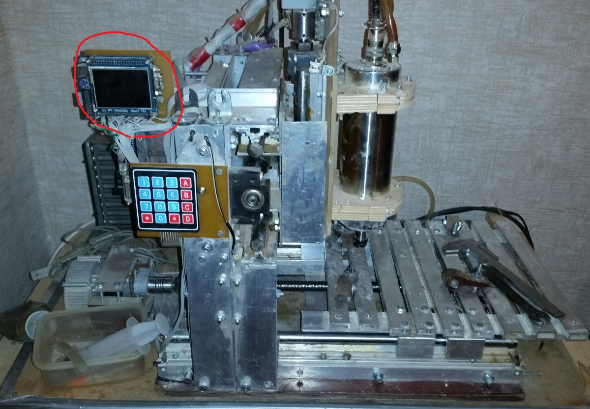

	STM32F103 cnc controller (encoders support)

https://www.youtube.com/watch?v=5unnjh0idlw

Windows gcc for stm32F103: 
 1. download https://drive.google.com/open?id=0B3hH5_ZXlbvwS000U0dhZnl2cGc
 2. unzip in any place 
 3. "./make.cmd D:\xxx\watering_ctrl all"

                                                
                                                
                                                
                                                
                                                
